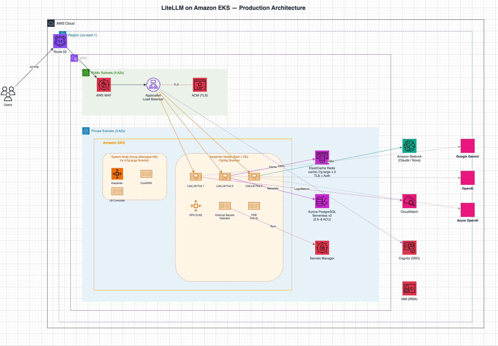

# LiteLLM on Amazon EKS — 生产级部署文档

[](LICENSE)
[](https://aws.amazon.com/eks/)
[](https://github.com/BerriAI/litellm)

> 多 LLM 网关：统一代理 AWS Bedrock (Claude)、Google Gemini、OpenAI、Azure OpenAI，  
> 支持 API Key 管理、缓存、限流、可观测性。

从零到生产的完整部署手册：一套已脱敏的 K8s manifest + 部署脚本 + 运维文档，覆盖
EKS → Karpenter → Redis/Aurora → Secrets → Helm → IRSA → CloudFront 全链路。
所有真实值（账号 ID、域名、ARN）都不入库，通过占位符 + `render-and-apply.sh` 在应用时注入。

## 文档导航

| 文档 | 内容 |
|------|------|
| [本 README](#部署步骤) | 主干部署流程（10 步）、组件清单、WAF/模型/SSO/运维/清理 |
| [docs/operations.md](docs/operations.md) | 完整运维手册：升级、回滚、Secrets 轮换、已知问题、紧急场景 |
| [docs/monitoring-logging-audit-guide.md](docs/monitoring-logging-audit-guide.md) | 监控/日志/审计三维度 + S3 请求日志 |
| [docs/bedrock-openai-gpt-guide.md](docs/bedrock-openai-gpt-guide.md) | GPT-5.5/5.4 经 Bedrock 接入（直连 + LiteLLM 两条路径） |
| [docs/agentcore-websearch-runbook.md](docs/agentcore-websearch-runbook.md) | AgentCore 托管 Web Search 接入 runbook |
| [docs/search-backend-benchmark.md](docs/search-backend-benchmark.md) | 搜索后端对比实测（AgentCore vs exa vs tavily vs SearXNG，延迟+盲评效果） |
| [docs/cloudfront-migration-plan.md](docs/cloudfront-migration-plan.md) | CloudFront + VPC Origin 改造方案 |
| [docs/cloudfront-llm-config.md](docs/cloudfront-llm-config.md) | CloudFront LLM 代理场景配置要点 |
| [docs/cdn-acceleration-analysis.md](docs/cdn-acceleration-analysis.md) | CloudFront / Global Accelerator 加速分析 |
| [docs/gateway-alternatives-evaluation.md](docs/gateway-alternatives-evaluation.md) | 网关选型评估（LiteLLM vs Bifrost vs new-api） |
| [docs/tokyo-docker-enterprise-hardening.md](docs/tokyo-docker-enterprise-hardening.md) | 东京 Docker 环境企业级改造方案（DB→RDS / EC2→ASG，对标官方 CFN） |
| [docs/hotfix-pr26627.md](docs/hotfix-pr26627.md) | Hotfix PR #26627 — Bedrock AIP ARN Prompt Cache 修复 |

## 架构概览



<details>
<summary>文本版架构图</summary>

```
                    ┌──────────────────────────────────────────────────────────┐
                    │                      AWS Cloud                           │
                    │                                                          │
  User ──HTTPS──▶  │  Route53 → CloudFront (WAF+TLS) ─── VPC Origin ───┐    │
                    │                                                    │    │
                    │         ┌─────────────── VPC ─────────────────┐   │    │
                    │         │                                      │   │    │
                    │         │  Internal ALB ◀─────────────────────┘   │    │
                    │         │       │                                  │    │
                    │         │       ▼                                  │    │
                    │         │  EKS (LiteLLM x3) ──▶ Bedrock Claude   │    │
                    │         │       │    │                             │    │
                    │         │       │    ├──▶ Google Gemini API        │    │
                    │         │       │    ├──▶ OpenAI API               │    │
                    │         │       │    └──▶ Azure OpenAI API         │    │
                    │         │       │                                  │    │
                    │         │       ├──▶ ElastiCache Redis (缓存)      │    │
                    │         │       └──▶ Aurora PostgreSQL (元数据)     │    │
                    │         │                                          │    │
                    │         └──────────────────────────────────────────┘    │
                    │                                                          │
                    │         Secrets Manager ◀── External Secrets Operator    │
                    └──────────────────────────────────────────────────────────┘
```

</details>

## 组件清单

| 组件 | 规格 | 用途 |
|------|------|------|
| EKS | K8s 1.35, 3 AZ | 容器编排 |
| 系统节点组 | 2× m7g.large Graviton (Managed NG, min=2/max=3) | Karpenter controller, CoreDNS, kube-proxy |
| 工作负载节点组 | Karpenter 自动扩缩 r7g/r6g Graviton (On-Demand) | LiteLLM Pod (nodeAffinity 限定) |
| LiteLLM | 3 副本, `litellm-database:main-stable` | LLM 代理网关 |
| Aurora PostgreSQL | Serverless v2 (0.5–8 ACU) | 用户/Key/用量元数据 |
| ElastiCache Redis | cache.r7g.large × 2, TLS+Auth | 响应缓存 |
| CloudFront | VPC Origin + WAFv2 + ACM TLS | 边缘入口、TLS 终止、WAF 拦截、byte streaming |
| ALB | Internal, HTTPS (ACM) | 内网负载均衡（仅接受 CloudFront VPC Origin 流量） |
| External Secrets Operator | Helm chart | 自动同步 Secrets Manager → K8s Secret |
| AWS LB Controller | Helm chart | 管理 ALB Ingress |

## 前置条件

- AWS CLI v2, `eksctl`, `kubectl`, `helm` 已安装
- 目标账号有足够 IAM 权限（EKS, EC2, RDS, ElastiCache, SecretsManager, IAM, Route53, ACM, ELB）
- 已在 ACM 中申请目标域名的 HTTPS 证书
- 已有 Route53 Hosted Zone 管理目标域名

---

## 部署步骤

### 0. 配置变量

编辑 `deploy.sh` 顶部的变量，替换为你的账号信息：

```bash
ACCOUNT_ID="<你的AWS账号ID>"
REGION="<目标区域>"              # 如 us-east-1
CLUSTER_NAME="litellm-cluster"
DOMAIN="<你的域名>"              # 如 litellm.example.com
HOSTED_ZONE_ID="<Route53 Zone ID>"
```

同时需要修改以下文件中的占位符：

| 文件 | 需替换内容 |
|------|-----------|
| `01-serviceaccount.yaml` | `eks.amazonaws.com/role-arn` 中的账号 ID |
| `07-ingress.yaml` | `certificate-arn` 替换为你的 ACM 证书 ARN |
| `07-ingress.yaml` | `inbound-cidrs` 替换为你的允许访问 CIDR |
| `07-ingress.yaml` | `wafv2-acl-arn` 替换为你的 WAF WebACL ARN |
| `07-ingress.yaml` | `host` 替换为你的域名 |
| `iam-policy.json` | `Resource` 中的账号 ID 和区域 |
| `eksctl-cluster.yaml` | `region`, `availabilityZones` |
| `11-karpenter-nodepool.yaml` | AZ 列表、集群名 |

### 1. 创建 EKS 集群

```bash
eksctl create cluster -f eksctl-cluster.yaml
aws eks update-kubeconfig --name $CLUSTER_NAME --region $REGION
```

预计耗时 ~15 分钟。

### 2. 安装 Karpenter 并创建节点池

```bash
# 2a. 给 private 子网和集群安全组打 Karpenter 发现标签
CLUSTER_SG=$(aws eks describe-cluster --name $CLUSTER_NAME --region $REGION \
  --query "cluster.resourcesVpcConfig.clusterSecurityGroupId" --output text)
PRIVATE_SUBNETS=$(aws ec2 describe-subnets \
  --filters "Name=vpc-id,Values=$VPC_ID" "Name=tag:kubernetes.io/role/internal-elb,Values=1" \
  --query "Subnets[].SubnetId" --output text --region $REGION)
for subnet in $PRIVATE_SUBNETS; do
  aws ec2 create-tags --resources $subnet --tags Key=karpenter.sh/discovery,Value=$CLUSTER_NAME --region $REGION
done
aws ec2 create-tags --resources $CLUSTER_SG --tags Key=karpenter.sh/discovery,Value=$CLUSTER_NAME --region $REGION

# 2b. 创建 Karpenter Node IAM 角色
aws iam create-role --role-name KarpenterNodeRole-$CLUSTER_NAME \
  --assume-role-policy-document '{"Version":"2012-10-17","Statement":[{"Effect":"Allow","Principal":{"Service":"ec2.amazonaws.com"},"Action":"sts:AssumeRole"}]}'
for policy in AmazonEKSWorkerNodePolicy AmazonEKS_CNI_Policy AmazonEC2ContainerRegistryReadOnly AmazonSSMManagedInstanceCore; do
  aws iam attach-role-policy --role-name KarpenterNodeRole-$CLUSTER_NAME --policy-arn arn:aws:iam::aws:policy/$policy
done
aws iam create-instance-profile --instance-profile-name KarpenterNodeInstanceProfile-$CLUSTER_NAME
aws iam add-role-to-instance-profile --instance-profile-name KarpenterNodeInstanceProfile-$CLUSTER_NAME --role-name KarpenterNodeRole-$CLUSTER_NAME
aws eks create-access-entry --cluster-name $CLUSTER_NAME --principal-arn arn:aws:iam::${ACCOUNT_ID}:role/KarpenterNodeRole-$CLUSTER_NAME --type EC2_LINUX --region $REGION

# 2c. 创建 Karpenter Controller IAM 角色 (IRSA)
# 参考 iam-policy.json 中的 Karpenter Controller 策略

# 2d. Helm 安装 Karpenter
CLUSTER_ENDPOINT=$(aws eks describe-cluster --name $CLUSTER_NAME --region $REGION --query "cluster.endpoint" --output text)
helm upgrade --install karpenter oci://public.ecr.aws/karpenter/karpenter \
  --version "1.3.0" \
  --namespace kube-system \
  --set "settings.clusterName=$CLUSTER_NAME" \
  --set "settings.clusterEndpoint=$CLUSTER_ENDPOINT" \
  --set "serviceAccount.annotations.eks\.amazonaws\.com/role-arn=arn:aws:iam::${ACCOUNT_ID}:role/KarpenterControllerRole-$CLUSTER_NAME" \
  --wait

# 2e. 应用 NodePool 和 EC2NodeClass
kubectl apply -f 11-karpenter-nodepool.yaml
```

### 3. 创建 ElastiCache Redis

```bash
# 获取 VPC 信息
VPC_ID=$(aws eks describe-cluster --name $CLUSTER_NAME --region $REGION \
  --query 'cluster.resourcesVpcConfig.vpcId' --output text)

PRIVATE_SUBNETS=$(aws ec2 describe-subnets --region $REGION \
  --filters "Name=vpc-id,Values=$VPC_ID" \
            "Name=tag:kubernetes.io/role/internal-elb,Values=1" \
  --query 'Subnets[*].SubnetId' --output text | tr '\t' ',')

NODE_SG=$(aws ec2 describe-security-groups --region $REGION \
  --filters "Name=vpc-id,Values=$VPC_ID" \
            "Name=tag:aws:eks:cluster-name,Values=$CLUSTER_NAME" \
  --query 'SecurityGroups[0].SecurityGroupId' --output text)

# 创建 Redis 安全组（允许 EKS 节点访问 6379）
REDIS_SG=$(aws ec2 create-security-group --group-name litellm-redis-sg \
  --description "LiteLLM Redis" --vpc-id $VPC_ID --region $REGION \
  --query 'GroupId' --output text)
aws ec2 authorize-security-group-ingress --group-id $REDIS_SG --region $REGION \
  --protocol tcp --port 6379 --source-group $NODE_SG

# 创建子网组
aws elasticache create-cache-subnet-group --region $REGION \
  --cache-subnet-group-name litellm-redis-subnet \
  --cache-subnet-group-description "LiteLLM Redis" \
  --subnet-ids $(echo $PRIVATE_SUBNETS | tr ',' ' ')

# 创建 Redis 集群
REDIS_AUTH_TOKEN=$(openssl rand -hex 20)
aws elasticache create-replication-group --region $REGION \
  --replication-group-id litellm-redis \
  --replication-group-description "LiteLLM Redis" \
  --engine redis --engine-version 7.1 \
  --cache-node-type cache.r7g.large \
  --num-cache-clusters 2 \
  --cache-subnet-group-name litellm-redis-subnet \
  --security-group-ids $REDIS_SG \
  --transit-encryption-enabled \
  --auth-token "$REDIS_AUTH_TOKEN" \
  --at-rest-encryption-enabled \
  --automatic-failover-enabled --multi-az-enabled

# 等待就绪（~10 分钟）
aws elasticache wait replication-group-available \
  --replication-group-id litellm-redis --region $REGION

REDIS_ENDPOINT=$(aws elasticache describe-replication-groups --region $REGION \
  --replication-group-id litellm-redis \
  --query 'ReplicationGroups[0].NodeGroups[0].PrimaryEndpoint.Address' --output text)

echo "Redis: $REDIS_ENDPOINT"
echo "Auth Token: $REDIS_AUTH_TOKEN"
```

### 4. 创建 Aurora PostgreSQL Serverless v2

```bash
# RDS 安全组
RDS_SG=$(aws ec2 create-security-group --group-name litellm-rds-sg \
  --description "LiteLLM RDS" --vpc-id $VPC_ID --region $REGION \
  --query 'GroupId' --output text)
aws ec2 authorize-security-group-ingress --group-id $RDS_SG --region $REGION \
  --protocol tcp --port 5432 --source-group $NODE_SG

# 子网组
aws rds create-db-subnet-group --region $REGION \
  --db-subnet-group-name litellm-rds-subnet \
  --db-subnet-group-description "LiteLLM RDS" \
  --subnet-ids $(echo $PRIVATE_SUBNETS | tr ',' ' ')

# Aurora 集群
DB_PASSWORD=$(openssl rand -base64 24 | tr -d '/+=')
aws rds create-db-cluster --region $REGION \
  --db-cluster-identifier litellm-db \
  --engine aurora-postgresql --engine-version 16.4 \
  --master-username litellm_admin \
  --master-user-password "$DB_PASSWORD" \
  --db-subnet-group-name litellm-rds-subnet \
  --vpc-security-group-ids $RDS_SG \
  --serverless-v2-scaling-configuration MinCapacity=0.5,MaxCapacity=8 \
  --storage-encrypted --database-name litellm

# Serverless v2 实例
aws rds create-db-instance --region $REGION \
  --db-instance-identifier litellm-db-instance-1 \
  --db-cluster-identifier litellm-db \
  --engine aurora-postgresql --db-instance-class db.serverless

# 等待就绪（~10 分钟）
aws rds wait db-instance-available \
  --db-instance-identifier litellm-db-instance-1 --region $REGION

RDS_ENDPOINT=$(aws rds describe-db-clusters --region $REGION \
  --db-cluster-identifier litellm-db \
  --query 'DBClusters[0].Endpoint' --output text)

DATABASE_URL="postgresql://litellm_admin:${DB_PASSWORD}@${RDS_ENDPOINT}:5432/litellm"
echo "Aurora: $RDS_ENDPOINT"
```

### 5. 写入 Secrets Manager

```bash
MASTER_KEY=$(openssl rand -hex 32)
SALT_KEY=$(openssl rand -hex 16)

# 必需密钥
aws secretsmanager create-secret --name litellm/master-key   --secret-string "$MASTER_KEY"     --region $REGION
aws secretsmanager create-secret --name litellm/salt-key     --secret-string "$SALT_KEY"        --region $REGION
aws secretsmanager create-secret --name litellm/database-url --secret-string "$DATABASE_URL"    --region $REGION
aws secretsmanager create-secret --name litellm/redis-host   --secret-string "$REDIS_ENDPOINT"  --region $REGION
aws secretsmanager create-secret --name litellm/redis-password --secret-string "$REDIS_AUTH_TOKEN" --region $REGION

# 可选密钥（先用占位符，后续替换真实值）
aws secretsmanager create-secret --name litellm/azure-api-key  --secret-string "PLACEHOLDER" --region $REGION
aws secretsmanager create-secret --name litellm/azure-api-base --secret-string "PLACEHOLDER" --region $REGION
aws secretsmanager create-secret --name litellm/gemini-api-key --secret-string "PLACEHOLDER" --region $REGION
aws secretsmanager create-secret --name litellm/openai-api-key --secret-string "PLACEHOLDER" --region $REGION
aws secretsmanager create-secret --name litellm/ui-password    --secret-string "PLACEHOLDER" --region $REGION

# SSO 密钥（Cognito OIDC，见"SSO 配置"章节）
aws secretsmanager create-secret --name litellm/cognito-client-id     --secret-string "$COGNITO_CLIENT_ID" --region $REGION
aws secretsmanager create-secret --name litellm/cognito-client-secret --secret-string "$COGNITO_CLIENT_SECRET" --region $REGION

echo "Master Key: sk-$MASTER_KEY"
```

> ⚠️ 记录 `MASTER_KEY`，这是调用 LiteLLM API 的认证密钥。

### 6. 安装 Helm 组件

```bash
# AWS Load Balancer Controller
helm repo add eks https://aws.github.io/eks-charts && helm repo update
helm install aws-load-balancer-controller eks/aws-load-balancer-controller \
  -n kube-system \
  --set clusterName=$CLUSTER_NAME \
  --set serviceAccount.create=false \
  --set serviceAccount.name=aws-load-balancer-controller

# External Secrets Operator
helm repo add external-secrets https://charts.external-secrets.io
helm install external-secrets external-secrets/external-secrets \
  -n external-secrets --create-namespace

# Metrics Server（HPA 依赖）
kubectl apply -f https://github.com/kubernetes-sigs/metrics-server/releases/latest/download/components.yaml
```

### 7. 创建 IRSA Role

```bash
OIDC_PROVIDER=$(aws eks describe-cluster --name $CLUSTER_NAME --region $REGION \
  --query 'cluster.identity.oidc.issuer' --output text | sed 's|https://||')

# 创建信任策略
cat > /tmp/trust-policy.json <<EOF
{
  "Version": "2012-10-17",
  "Statement": [{
    "Effect": "Allow",
    "Principal": {
      "Federated": "arn:aws:iam::${ACCOUNT_ID}:oidc-provider/${OIDC_PROVIDER}"
    },
    "Action": "sts:AssumeRoleWithWebIdentity",
    "Condition": {
      "StringEquals": {
        "${OIDC_PROVIDER}:sub": "system:serviceaccount:litellm:litellm-sa",
        "${OIDC_PROVIDER}:aud": "sts.amazonaws.com"
      }
    }
  }]
}
EOF

aws iam create-role --role-name litellm-irsa-role \
  --assume-role-policy-document file:///tmp/trust-policy.json

# 附加权限策略（Bedrock + SecretsManager + CloudWatch）
aws iam put-role-policy --role-name litellm-irsa-role \
  --policy-name litellm-policy --policy-document file://iam-policy.json

# ⚠️ 重要：Bedrock foundation-model ARN 不含账号 ID，需额外添加
aws iam put-role-policy --role-name litellm-irsa-role \
  --policy-name litellm-bedrock-models \
  --policy-document '{
    "Version": "2012-10-17",
    "Statement": [{
      "Effect": "Allow",
      "Action": ["bedrock:InvokeModel", "bedrock:InvokeModelWithResponseStream"],
      "Resource": ["arn:aws:bedrock:*::foundation-model/*"]
    }]
  }'

# S3 请求日志（s3_v2 callback，见 04-configmap.yaml 的 s3_callback_params）
# 仅当启用 S3 日志时需要；桶需先创建（建议开启加密 + 阻断公开访问）
aws iam put-role-policy --role-name litellm-irsa-role \
  --policy-name litellm-s3-logs-write \
  --policy-document '{
    "Version": "2012-10-17",
    "Statement": [{
      "Effect": "Allow",
      "Action": ["s3:PutObject"],
      "Resource": ["arn:aws:s3:::litellm-request-logs-<YOUR_ACCOUNT_ID>-us-east-1/*"]
    }]
  }'
```

### 8. 部署 K8s 资源

```bash
kubectl apply -f 00-namespace.yaml

# ⚠️ 关键：放宽 PodSecurity 到 baseline（LiteLLM 镜像需要 root 运行 Prisma）
kubectl label ns litellm \
  pod-security.kubernetes.io/enforce=baseline \
  pod-security.kubernetes.io/warn=baseline --overwrite

kubectl apply -f 01-serviceaccount.yaml
kubectl apply -f 02-secretstore.yaml
kubectl apply -f 03-externalsecret.yaml
kubectl apply -f 04-configmap.yaml
kubectl apply -f 05-deployment.yaml
kubectl apply -f 06-service.yaml
kubectl apply -f 07-ingress.yaml
kubectl apply -f 08-hpa.yaml
kubectl apply -f 09-pdb.yaml
kubectl apply -f 10-networkpolicy.yaml

# 等待就绪
kubectl rollout status deployment/litellm -n litellm --timeout=300s
```

### 9. 配置 CloudFront + Route53

详见 [docs/cloudfront-migration-plan.md](docs/cloudfront-migration-plan.md) 和 [docs/cloudfront-llm-config.md](docs/cloudfront-llm-config.md)。

```bash
# CloudFront Distribution 创建后，DNS 指向 CloudFront（非直连 ALB）
CF_DOMAIN="<your-cf-distribution>.cloudfront.net"

aws route53 change-resource-record-sets --hosted-zone-id $HOSTED_ZONE_ID \
  --change-batch "{
    \"Changes\": [{
      \"Action\": \"UPSERT\",
      \"ResourceRecordSet\": {
        \"Name\": \"$DOMAIN\",
        \"Type\": \"A\",
        \"AliasTarget\": {
          \"HostedZoneId\": \"Z2FDTNDATAQYW2\",
          \"DNSName\": \"$CF_DOMAIN\",
          \"EvaluateTargetHealth\": false
        }
      }
    }]
  }"
# Z2FDTNDATAQYW2 是 CloudFront 的固定 Hosted Zone ID
```

### 10. 验证

```bash
# 健康检查
curl -sk https://$DOMAIN/health/readiness

# 期望输出：{"status":"connected","db":"connected","cache":"redis",...}

# 调用 Claude
curl -sk https://$DOMAIN/v1/chat/completions \
  -H "Authorization: Bearer sk-$MASTER_KEY" \
  -H "Content-Type: application/json" \
  -d '{
    "model": "claude-3-5-sonnet",
    "messages": [{"role": "user", "content": "Hello"}]
  }'
```

---

## 文件清单

```
litellm-eks/
├── deploy.sh                    # 一键部署脚本（包含所有步骤）
├── eksctl-cluster.yaml          # EKS 集群定义
├── iam-policy.json              # IRSA IAM 权限策略
├── 00-namespace.yaml            # Namespace
├── 01-serviceaccount.yaml       # ServiceAccount (IRSA)
├── 02-secretstore.yaml          # ESO SecretStore
├── 03-externalsecret.yaml       # ESO ExternalSecret (12 个密钥)
├── 04-configmap.yaml            # LiteLLM 配置（模型列表、路由、缓存、S3 日志 callback）
├── 05-deployment.yaml           # Deployment (3 副本, 反亲和, 探针)
├── 06-service.yaml              # ClusterIP Service
├── 07-ingress.yaml              # Internal ALB Ingress (CloudFront VPC Origin 接入)
├── 08-hpa.yaml                  # HPA (CPU 65% / Memory 75%, 3-20 副本)
├── 09-pdb.yaml                  # PDB (最少 2 可用)
├── 10-networkpolicy.yaml        # NetworkPolicy (零信任)
├── 11-karpenter-nodepool.yaml   # Karpenter v1.3.0 NodePool + EC2NodeClass
├── 12-searxng.yaml              # SearXNG (web_search interception 后端)
├── values.example.env          # render-and-apply 占位符示例
├── render-and-apply.sh          # 应用时注入真实值（账号/域名/ARN 不入库）
├── check-placeholders.sh        # 防止把占位符误 apply 到生产
├── architecture.drawio / .png   # 架构图
└── docs/                        # 专题文档
    ├── operations.md                     # 完整运维手册
    ├── monitoring-logging-audit-guide.md # 监控/日志/审计 + S3 日志
    ├── bedrock-openai-gpt-guide.md       # GPT-5.5/5.4 via Bedrock 接入
    ├── agentcore-websearch-runbook.md    # AgentCore 托管 Web Search runbook
    ├── cloudfront-migration-plan.md      # CloudFront + VPC Origin 改造方案
    ├── cloudfront-llm-config.md          # CloudFront LLM 场景配置要点
    ├── cdn-acceleration-analysis.md      # CDN 加速分析
    ├── gateway-alternatives-evaluation.md # 网关选型评估
    └── hotfix-pr26627.md                 # PR26627 热修复说明
```

---

## 踩坑记录 & 注意事项

### 🔴 必须注意

| # | 问题 | 解决方案 |
|---|------|---------|
| 1 | **Prisma query engine 权限** — LiteLLM 镜像在构建时以 root 安装 Prisma binary 到 `/root/.cache/prisma-python/`，`runAsUser: 1000` 无法访问 | 使用 `litellm-database` 镜像 + PodSecurity 设为 `baseline` + 不设 `runAsUser`（以 root 运行） |
| 2 | **Bedrock foundation-model ARN** — 格式为 `arn:aws:bedrock:*::foundation-model/*`（无账号 ID，双冒号） | IAM 策略中 Resource 不能包含账号 ID |
| 3 | **NetworkPolicy 阻断 ALB→Pod** — ALB 通过 VPC IP 直连 Pod（target-type: ip），不经过 kube-system namespace | ingress 规则需添加 `ipBlock: <VPC CIDR>` |
| 4 | **NetworkPolicy 阻断 Pod→ElastiCache/RDS** — Redis/RDS 在 VPC 内但不在 K8s namespace 中 | egress 规则用 `ipBlock: <VPC CIDR>` 而非 `namespaceSelector` |
| 5 | **`--detailed_debug False` 参数** — LiteLLM 不支持此 CLI 参数，会导致启动崩溃 | 不要添加此参数 |
| 6 | **ALB access_logs 注解** — 如果指定的 S3 bucket 不存在，ALB Controller 会 reconcile 失败 | 要么先创建 bucket，要么不加 access_logs 注解 |
| 7 | **Karpenter v1.3.0 API 变更** — `nodeClassRef.apiVersion` 字段已移除，`consolidationPolicy` 值 `WhenUnderutilized` 改为 `WhenEmptyOrUnderutilized` | 使用 `nodeClassRef.group: karpenter.k8s.aws` 替代；EC2NodeClass 必须包含 `amiSelectorTerms` |
| 8 | **Karpenter 子网/安全组发现** — NodeClaim 创建失败，找不到子网或安全组 | 必须给 private 子网和集群安全组打 `karpenter.sh/discovery=<cluster-name>` 标签 |
| 9 | **Karpenter 不能运行在自己管理的节点上** — nodeAffinity 要求 `karpenter.sh/nodepool DoesNotExist`，纯 Karpenter 集群无法启动 | 必须保留 Managed Node Group (min=2) 作为系统节点，运行 Karpenter controller；LiteLLM Deployment 需添加 `nodeAffinity: karpenter.sh/nodepool Exists` 避免调度到系统节点 |
| 10 | **AWS LB Controller IMDS 失败** — 切换到 Graviton 节点后，LB Controller 无法从 EC2 Instance Metadata 获取 VPC ID，CrashLoopBackOff | 启动参数添加 `--aws-vpc-id=<VPC_ID>` 显式指定 VPC ID |
| 11 | **SSO 免费限制** — LiteLLM SSO 功能免费仅限 5 用户（v1.76.0+），超过需 Enterprise License | 评估用户数，必要时申请 License |

---

## WAF 配置

ALB 已关联 WAFv2 WebACL，提供三层应用层防护：

| 规则 | 模式 | 说明 |
|------|------|------|
| AWS Managed Core Rule Set | Count（仅记录） | SQL 注入、XSS、路径遍历等 OWASP Top 10 |
| AWS Managed Known Bad Inputs | Count（仅记录） | 已知恶意请求模式 |
| Rate Limit 1000/5min | Block（拦截） | 单 IP 每 5 分钟超 1000 次请求则拦截 |

**创建 WAF WebACL**：

```bash
# 创建 WAFv2 WebACL（Core Rule Set Count + Known Bad Inputs Count + Rate Limit Block）
aws wafv2 create-web-acl \
  --name litellm-waf \
  --scope REGIONAL \
  --default-action Allow={} \
  --rules '[
    {"Name":"AWS-AWSManagedRulesCommonRuleSet","Priority":1,"OverrideAction":{"Count":{}},"Statement":{"ManagedRuleGroupStatement":{"VendorName":"AWS","Name":"AWSManagedRulesCommonRuleSet"}},"VisibilityConfig":{"SampledRequestsEnabled":true,"CloudWatchMetricsEnabled":true,"MetricName":"CommonRuleSet"}},
    {"Name":"AWS-AWSManagedRulesKnownBadInputsRuleSet","Priority":2,"OverrideAction":{"Count":{}},"Statement":{"ManagedRuleGroupStatement":{"VendorName":"AWS","Name":"AWSManagedRulesKnownBadInputsRuleSet"}},"VisibilityConfig":{"SampledRequestsEnabled":true,"CloudWatchMetricsEnabled":true,"MetricName":"KnownBadInputs"}},
    {"Name":"RateLimit-1000-per-IP","Priority":3,"Action":{"Block":{}},"Statement":{"RateBasedStatement":{"Limit":1000,"EvaluationWindowSec":300,"AggregateKeyType":"IP"}},"VisibilityConfig":{"SampledRequestsEnabled":true,"CloudWatchMetricsEnabled":true,"MetricName":"RateLimit"}}
  ]' \
  --visibility-config SampledRequestsEnabled=true,CloudWatchMetricsEnabled=true,MetricName=litellm-waf \
  --tags Key=Project,Value=litellm \
  --region us-east-1
```

将返回的 ARN 填入 `07-ingress.yaml` 的 `wafv2-acl-arn` 注解，然后 `kubectl apply`。

**观察与切换**：在 CloudWatch 中观察 `CommonRuleSet` 和 `KnownBadInputs` 指标，确认无误报后将 Count 切换为 Block。
| 7 | **Rolling Update 限制** — hard podAntiAffinity + 节点数 = 副本数时，无法滚动更新（没有空闲节点放新 Pod） | 更新时先 `kubectl scale deployment/litellm --replicas=0 -n litellm` 再 `scale --replicas=3`，或增加节点数到 > 副本数 |

### 🟡 建议

| 项目 | 说明 |
|------|------|
| **镜像版本** | 生产环境建议锁定具体版本（如 `v1.81.14`）而非 `main-stable` |
| **Claude 模型** | Claude 3.5 Sonnet v2 已标记 Legacy，建议使用 Claude Sonnet 4 |
| **LITELLM_MIGRATION_DIR** | 设为 `/tmp/migrations`，避免写入只读的 site-packages 目录 |
| **HOME 环境变量** | 设为 `/tmp`，确保 Prisma CLI 的缓存写入可写目录 |

---

## 模型配置

在 `04-configmap.yaml` 中配置模型列表。当前支持：

### AWS Bedrock Claude 模型（IRSA 认证，无需 API Key）

| 模型别名 | Bedrock 模型 ID | 说明 |
|----------|----------------|------|
| `bedrock-claude-opus47` | `bedrock/us.anthropic.claude-opus-4-7` | Claude Opus 4.7（最新，1M context） |
| `bedrock-claude-opus46` | `bedrock/us.anthropic.claude-opus-4-6-v1` | Claude Opus 4.6（1M context） |
| `bedrock-claude-opus45` | `bedrock/us.anthropic.claude-opus-4-5-20251101-v1:0` | Claude Opus 4.5 |
| `bedrock-claude-sonnet46` | `bedrock/us.anthropic.claude-sonnet-4-6` | Claude Sonnet 4.6 |
| `bedrock-claude-sonnet46-1m` | 同上 + `anthropic-beta: context-1m-2025-08-07` | Sonnet 4.6（1M context 变体） |
| `bedrock-claude-haiku45` | `bedrock/us.anthropic.claude-haiku-4-5-20251001-v1:0` | Claude Haiku 4.5 |

### AWS Bedrock Nova 模型（IRSA 认证）

| 模型别名 | Bedrock 模型 ID | 说明 |
|----------|----------------|------|
| `bedrock-nova-premier` | `bedrock/us.amazon.nova-premier-v1:0` | Nova Premier |
| `bedrock-nova-pro` | `bedrock/us.amazon.nova-pro-v1:0` | Nova Pro |
| `bedrock-nova-lite` | `bedrock/us.amazon.nova-lite-v1:0` | Nova Lite |
| `bedrock-nova-micro` | `bedrock/us.amazon.nova-micro-v1:0` | Nova Micro |

### 其他 LLM 提供商（需 API Key）

| 模型别名 | 实际模型 | Provider | 认证方式 |
|----------|---------|----------|---------|
| `gpt-4o` | Azure GPT-4o | Azure OpenAI | `AZURE_API_KEY` + `AZURE_API_BASE` |
| `gemini-2.0-flash` | Gemini 2.0 Flash | Google | `GEMINI_API_KEY` |
| `gemini-2.5-pro` | Gemini 2.5 Pro Preview | Google | `GEMINI_API_KEY` |
| `gpt-4o-openai` | GPT-4o | OpenAI | `OPENAI_API_KEY` |
| `o3-mini` | o3-mini | OpenAI | `OPENAI_API_KEY` |

添加新模型只需编辑 ConfigMap 并重启 Pod：

```bash
kubectl edit configmap litellm-config -n litellm
kubectl rollout restart deployment/litellm -n litellm
```

---

## SSO 配置（Cognito OIDC）

管理界面（`/ui`）通过 AWS Cognito SSO 认证，API 调用仍使用 Master Key / per-user Key。

### 组件

| 组件 | 说明 |
|------|------|
| Cognito User Pool | `<YOUR_USER_POOL_ID>` |
| Cognito Domain | `<YOUR_COGNITO_DOMAIN>.auth.<REGION>.amazoncognito.com` |
| Callback URL | `https://<YOUR_DOMAIN>/sso/callback` |
| 回退登录 | `https://<YOUR_DOMAIN>/fallback/login` |

### 角色映射

Cognito 默认在 JWT 中包含 `cognito:groups` claim，LiteLLM 直接读取该字段映射角色（无需 Lambda）。

| Cognito 组 | LiteLLM 角色 | 权限 |
|-----------|-------------|------|
| `admin` | `proxy_admin` | 完全管理（用户、模型、Key、配额） |
| `viewer` | `proxy_admin_viewer` | 管理界面只读 |
| `users` | `internal_user` | 创建/管理自己的 API Key |
| `user_viewer` | `internal_user_viewer` | 只能查看自己的 Key |

### 用户管理

通过 AWS Console（Cognito → User pools → `<YOUR_POOL_NAME>`）或 CLI：

```bash
# 创建用户
aws cognito-idp admin-create-user --user-pool-id $USER_POOL_ID \
  --username <用户名> --user-attributes Name=email,Value=<邮箱> Name=email_verified,Value=true \
  --region $REGION

# 设置密码
aws cognito-idp admin-set-user-password --user-pool-id $USER_POOL_ID \
  --username <用户名> --password '<密码>' --permanent --region $REGION

# 分配组
aws cognito-idp admin-add-user-to-group --user-pool-id $USER_POOL_ID \
  --username <用户名> --group-name admin --region $REGION
```

---

## 运维命令

> 📖 **完整运维手册见 [docs/operations.md](docs/operations.md)** — 包含升级流程、回滚、Secrets 轮换、已知问题、紧急场景等

```bash
# 查看 Pod 状态
kubectl get pods -n litellm

# 查看日志
kubectl logs -n litellm -l app=litellm --tail=100

# 健康检查
curl -sk https://$DOMAIN/health/readiness

# 更新部署（滚动更新，零停机）
kubectl apply -f 05-deployment.yaml
kubectl rollout restart deployment/litellm -n litellm
# 注意：如果工作节点数 = 副本数（无空闲节点），hard podAntiAffinity 会导致
# 滚动更新卡住，此时需要 scale 0→3 或增加节点

# 更新 API Key
aws secretsmanager put-secret-value --secret-id litellm/openai-api-key \
  --secret-string "sk-your-real-key" --region $REGION
# ESO 每小时自动同步，或手动触发：
kubectl delete secret litellm-secrets -n litellm
# ExternalSecret 会自动重建

# 查看 HPA 状态
kubectl get hpa -n litellm

# 查看 ALB 状态
kubectl get ingress -n litellm

# 查看 CloudFront Distribution 状态
aws cloudfront list-distributions \
  --query 'DistributionList.Items[?Comment==`LiteLLM Proxy - Internal ALB via VPC Origin`].{Id:Id,Domain:DomainName,Status:Status}' \
  --output table
```

---

## 清理

```bash
# 删除 K8s 资源
kubectl delete -f 07-ingress.yaml
kubectl delete -f 05-deployment.yaml
kubectl delete ns litellm

# 删除 ElastiCache
aws elasticache delete-replication-group --replication-group-id litellm-redis \
  --no-final-snapshot-identifier --region $REGION

# 删除 Aurora
aws rds delete-db-instance --db-instance-identifier litellm-db-instance-1 \
  --skip-final-snapshot --region $REGION
aws rds delete-db-cluster --db-cluster-identifier litellm-db \
  --skip-final-snapshot --region $REGION

# 删除 Secrets Manager
for s in master-key salt-key database-url redis-host redis-password \
         azure-api-key azure-api-base gemini-api-key openai-api-key ui-password \
         cognito-client-id cognito-client-secret; do
  aws secretsmanager delete-secret --secret-id "litellm/$s" \
    --force-delete-without-recovery --region $REGION
done

# 删除 IAM Role
aws iam delete-role-policy --role-name litellm-irsa-role --policy-name litellm-policy
aws iam delete-role-policy --role-name litellm-irsa-role --policy-name litellm-bedrock-models
aws iam delete-role --role-name litellm-irsa-role

# 删除 EKS 集群
eksctl delete cluster --name $CLUSTER_NAME --region $REGION

# 删除 Route53 记录（手动在控制台或 CLI）
# 删除安全组（VPC 删除后自动清理）
```

---

## License

MIT — See [LICENSE](LICENSE).

## Acknowledgments

- [LiteLLM](https://github.com/BerriAI/litellm) by BerriAI — the proxy at the core of this stack
- [External Secrets Operator](https://external-secrets.io/) · [Karpenter](https://karpenter.sh/) · [AWS Load Balancer Controller](https://kubernetes-sigs.github.io/aws-load-balancer-controller/)
- AWS Bedrock Anthropic Claude / Amazon Nova series
